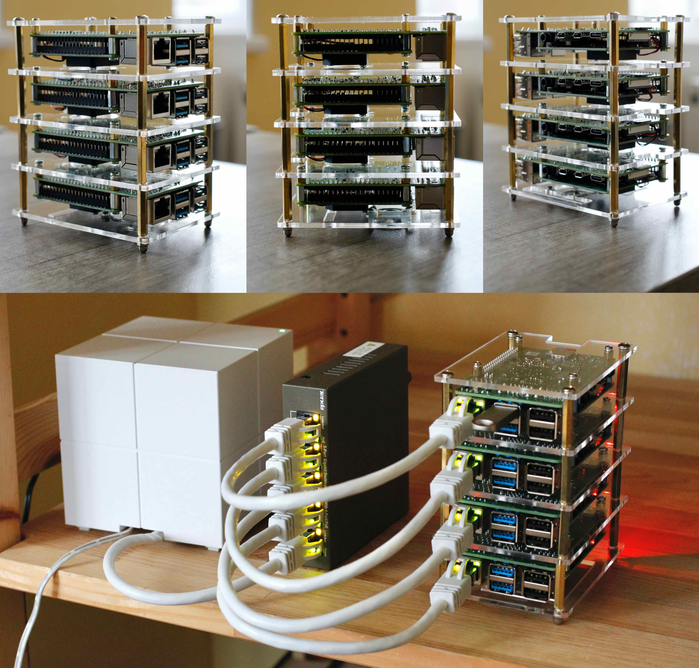

# Raspberry Pi Compute Cluster

For Christmas 2023 :christmas_tree:, so I decided to treat myself with
creating a Raspberry Pi Cluster. This repository documents my experience
building it, and the fun I have been up with it.

Please see pages:
 1. [Cluster Setup and Configuration ](./setup.md)
 2. [Costs breakdown](./costs.md#10)

##  Aims and Motivations
Broad aims, with some sprinkling of motivations-will add more as I run more
interesting tasks on it:.
- [ ]  create a test bench to understand concepts and techniques around:
  - [ ] parallel and concurrent programming
  - [ ] node clustering
  - [x] task distribution
  - [ ] basic benchmarking of task performance
- [x] gain familiarity with configuration of linux environments
- [x] gain familiarity with  HPC task distribution software like [SLURM](https://slurm.schedmd.com/)
  - [x] gain familiarity with Message Passing Interface (MPI)
  - [x] spawn and coordinate processes across nodes
- [x] write a minimal python script that uses [OpenMPI](https://www.open-mpi.org/)
- [ ] use [Dask](https://www.dask.org/get-started) to perform tasks over a cluster
- [x] create an isolated, controllable test bench
- [x] protects my main computer from any mishaps

## Why the write up?
- helps me report an update-to-date instruction (Dec 2023)
- explain and highlight interesting details
- remind me / reflect on the approach should I try it again or something related

## Benchmarking
- Big topic that can't be left out, TBC

## Some Pictures &nbsp; :camera:

## Acknowledgements
None of this was possible without the amazing guides, conferences and
documentation available online. For more details, please see the
[`ACKNOWLEDGEMENTS`](./ACKNOWLEDGEMENTS.md) and
[`further-reading`](./further-reading.md) pages.

